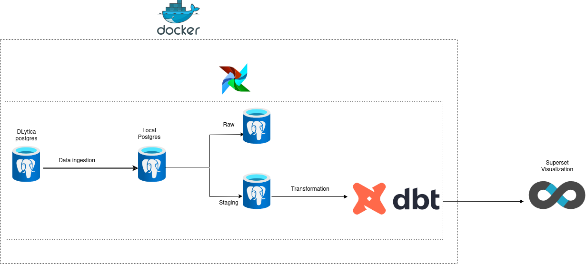
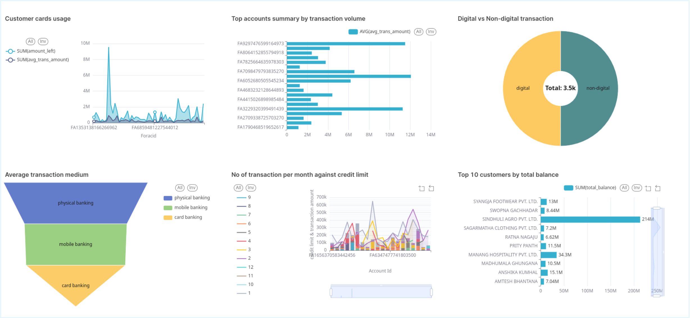

#  Banking Data ETL Pipeline

This project demonstrates a robust **ETL (Extract, Transform, Load) pipeline** for processing and visualizing banking data using modern data engineering tools like **Apache Airflow**, **DBT**, **PostgreSQL**, and **Apache Superset**.

---

## 📌 Objectives

- 🚀 Automate ingestion and transformation of banking data from the DLytica server.
- 🧹 Clean and model raw data into structured formats using DBT.
- 📊 Visualize key business metrics like customer trends, product usage, and transaction patterns in Superset.

---


---

## Datasets Used

This project processes multiple interconnected datasets provided from DLytica server:

- `transactions` – Individual transaction records
- `accounts` – Account-level metadata
- `customers` – Demographic and profile information
- `cards` – Card details (type, limits, etc.)
- `product` – Info on account types (savings, current, etc.)

---

## Tech Stack
- Python – for scripting and Airflow custom operators
- Airflow – orchestration
- PostgreSQL – raw source + mock data warehouse
- DBT – data transformation & modeling
- SQL – queries in dbt, source extracts
- Superset – dashboard/visualization
- Docker - airflow, dbt infrastructure

##  Pipeline Architecture



1. **Extract**  
   Fetches data from the DLytica source and stores it in the raw schema of PostgreSQL.

2. **Load (Staging)**  
   Using Airflow, raw tables are copied into a `staging` schema for preprocessing.

3. **Transform**  
   DBT models process and clean data through:
   - `staging`: Cleaned and formatted raw tables
   - `intermediate`: Business logic like joins and aggregations
   - `final_marts`: Ready-to-query analytical tables

4. **Visualize**  
   Final data marts are visualized via Apache Superset dashboards.
---

##  Airflow DAG Overview

Your DAG: `banking_data_pipeline`

- Creates and loads staging tables (`staging.*`) for each source table
- Executes DBT models in sequence:
  - Staging models
  - Intermediate models
  - Final marts

> DAG is scheduled to run **daily**, with retries and alerting enabled.

---

## 🔧 Setup Instructions

### 1. Clone the Repo

```bash
git clone https://github.com/yourusername/banking-data-etl-pipeline.git
cd banking-data-etl-pipeline
```

### 2. Configure Airflow Connections

Set up a PostgreSQL connection in Airflow with the ID: banking_data_postgres.

### 3. DBT Setup

Ensure your DBT project is placed at:

```bash
/opt/banking_data_dbt/
```

### 4. Run docker Pipeline

```bash
docker compose up build --no-cache
docker compose up
docker compose down --volumes --remove-orphans
```

---

##  📊 Dashboard 
Some insights of customers transaction:



